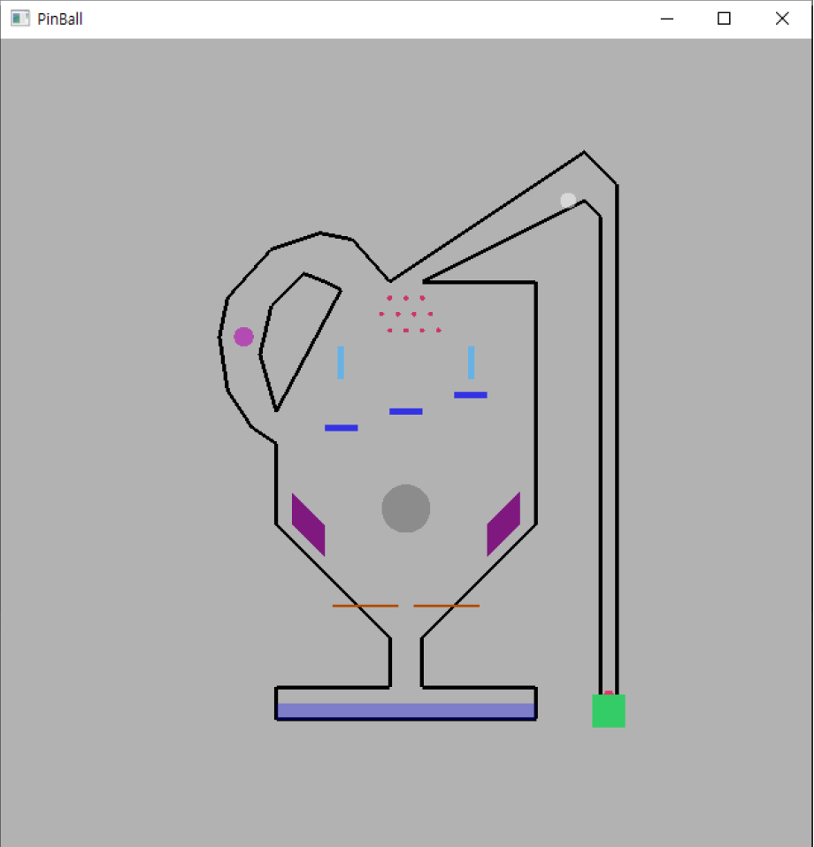
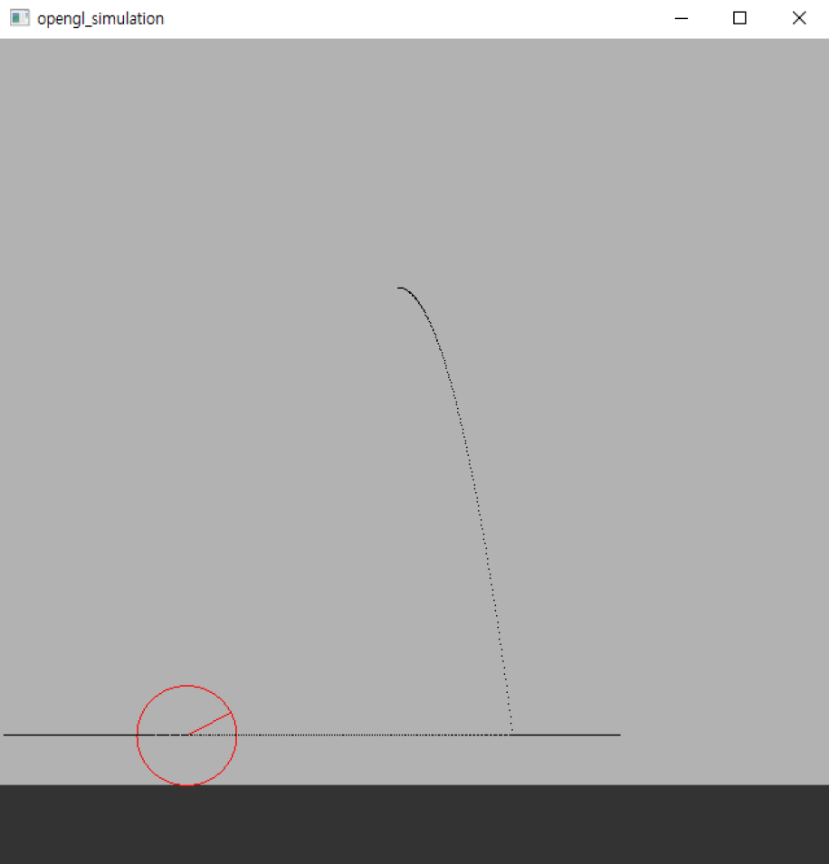

# 핀볼 시뮬레이션 프로젝트

---

 * [COSE436] pinball 2d simulation project
 * 학부수업 중간고사 대체 프로젝트
 * 핀볼 시뮬레이션 프로젝트 / 공굴리기 시뮬레이션 프로젝트가 한 묶음으로 구성됨

 

 ### 핀볼 프로젝트 설명

 ---
 
 * 윈도우 핀볼처럼 초록색 네모 발판(오른쪽 하단)을 밀어 빨간색 공을 핀볼 맵에서 이동시키는 시뮬레이션 게임
 * 5-6개 각기 다른 장애물을 구현
    * 발판(갈색) / 회전하는 장애물 / 좌우로 이동하는 장애물 등을 구현
 * 원형 맵을 일부분 추가
 * 조작법은 같이 동봉한 `.pdf` 파일에 상세히 기록되어 있으니 참고

 ### 공굴리기 프로젝트 설명

 ---

 

 * 처음 시작하면 빨간색 공은 공중에 떠 있는 상태로 시작
 * 시뮬레이션을 시작하면 천천히 떨어지기 시작함
 * 공이 지나간 경로는 검은색 점들로 남게 됨
 * 공이 땅에 떨어진 뒤에는 키 조작으로 왼쪽 / 오른쪽으로 굴리기 가능
    * 공의 탄성은 아예 없다고 가정하고 제작함
 * 조작법은 같이 동봉한 `.pdf` 파일에 상세히 기록되어 있으니 참고

